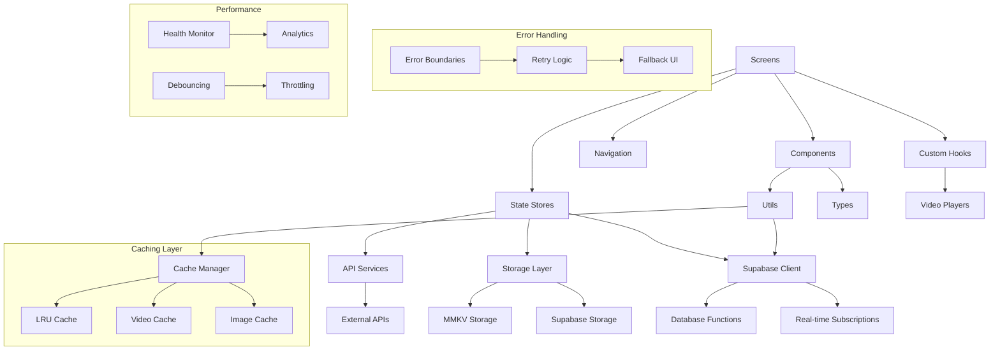

# BYTEROVER HANDBOOK - SupaSecret

*Generated on: 2025-09-07*
*Version: 2.0*
*Last Updated: 2025-09-07*

## Layer 1: System Overview

### Purpose
SupaSecret is a modern, anonymous confession sharing app built with React Native, Expo, and Supabase. The platform enables users to share secrets safely and anonymously through text and video confessions, with a focus on complete anonymity, privacy, and community engagement.

### Tech Stack
**Frontend:**
- React Native 0.79.2 - Cross-platform mobile framework
- Expo 53.0.9 - Development platform and build tools
- TypeScript 5.8.3 (strict mode) - Type-safe JavaScript
- NativeWind 4.1.23 - Tailwind CSS for React Native
- Zustand 5.0.4 - Lightweight state management
- React Navigation 7.x - Navigation library
- Reanimated 3.17.4 - High-performance animations
- React Native Gesture Handler 2.24.0 - Advanced gesture system

**Backend:**
- Supabase 2.57.0 - Backend-as-a-Service (Auth, Database, Storage, Realtime)
- PostgreSQL - Relational database with Row Level Security
- Edge Functions - Serverless functions
- Supabase Migrations - Database schema versioning

**Media & AI:**
- Expo AV 15.1.4 - Video recording and playback
- React Native Vision Camera 4.6.4 - Advanced camera features
- FFmpeg Kit 6.0.2 - Video processing and thumbnails
- OpenAI SDK 4.89.0 - AI integrations and transcription
- Anthropic SDK 0.39.0 - AI capabilities

**UI & Performance:**
- FlashList 1.7.6 - High-performance lists
- Victory Native 41.16.2 - Data visualization and charts
- React Native MMKV 3.2.0 - Fast key-value storage
- Lottie React Native 7.2.2 - Animations
- React Native Skia 2.0.0 - Advanced graphics

**Development:**
- ESLint & Prettier - Code quality and formatting
- Patch-package 8.0.0 - Dependency patches
- Expo Dev Client 5.1.7 - Enhanced development experience

### Architecture
**Pattern:** Layered Architecture with Feature-based Organization and Advanced Caching

```
├── Frontend Layer (React Native + Expo)
│   ├── Screens (View Layer)
│   ├── Components (Reusable UI with Skeletons)
│   ├── State Management (Zustand Stores with Persistence)
│   ├── Navigation (React Navigation with Deep Linking)
│   └── Hooks (Custom React Hooks)
├── Integration Layer
│   ├── API Services (AI integrations with retry logic)
│   ├── Supabase Client (with connection pooling)
│   ├── Caching Layer (LRU Cache + MMKV)
│   ├── Error Handling (Centralized with retry)
│   └── Utilities (Performance & Accessibility)
├── Data Layer
│   ├── Video Cache Manager (LRU eviction)
│   ├── Storage Utilities (Local + Cloud)
│   ├── Migration System (Database versioning)
│   └── Health Monitoring (Performance tracking)
└── Backend Layer (Supabase)
    ├── PostgreSQL Database (with migrations)
    ├── Row Level Security (RLS policies)
    ├── Storage Buckets (Video/Image storage)
    ├── Realtime Subscriptions (Live updates)
    ├── Edge Functions (Serverless processing)
    └── Analytics Functions (Trending calculations)
```

### Key Technical Decisions
- **Anonymous-First Design:** No mandatory authentication for posting confessions
- **Strict TypeScript:** Enhanced type safety and developer experience
- **Zustand State Management:** Simple, lightweight alternative to Redux with persistence
- **Supabase Backend:** Comprehensive BaaS with migration system and RLS
- **Advanced Performance:** FlashList, LRU caching, MMKV storage, video optimization
- **Cross-Platform First:** Shared codebase for iOS and Android with platform-specific optimizations
- **Modular Architecture:** Feature-based organization with clear separation of concerns
- **Error Resilience:** Comprehensive error handling with retry logic and fallbacks
- **Real-time Features:** Live updates for likes, comments, and trending data
- **Content Moderation:** AI-powered moderation with user reporting system

## Layer 2: Module Map

### Core Modules

#### 📱 Screens (`/src/screens/`)
- **HomeScreen** - Main feed of confessions with trending bar
- **CreateConfessionScreen** - Text/video confession creation with AI assistance
- **TrendingScreen** - Popular confessions and hashtags with analytics
- **ProfileScreen** - User profile and settings
- **NotificationsScreen** - User notifications and activity
- **VideoFeedScreen** - TikTok-style video browsing with gestures
- **VideoRecordScreen** - Video recording with face blur and voice change
- **VideoPlayerScreen** - Dedicated video player with controls
- **PaywallScreen** - Subscription/monetization with RevenueCat
- **OnboardingScreen** - New user experience and permissions
- **SavedScreen** - User's saved confessions and bookmarks
- **MySecretsScreen** - User's own confessions management
- **SecretDetailScreen** - Detailed view of individual confessions
- **SignInScreen** - User authentication and login
- **SignUpScreen** - User registration and account creation
- **SettingsScreen** - App preferences and user settings

#### 🧩 Components (`/src/components/`)
- **UI Components:**
  - AnimatedModal, AnimatedActionButton
  - AuthButton, AuthInput
  - LoadingSpinner, ProgressIndicator
  - ErrorBoundary, AppHeader

- **Skeleton Components:**
  - ConfessionSkeleton, NotificationSkeleton
  - TrendingSkeleton, VideoSkeleton

- **Feature Components:**
  - CommentBottomSheet, EnhancedCommentBottomSheet
  - ShareModal, EnhancedShareBottomSheet, ReportModal
  - VideoControls, VideoGuidanceOverlay, VideoProgressIndicator
  - TrendingBar, TrendingBarChart, TrendingBarItem
  - AdBanner, FeatureGate
  - FeedActionSheet, MigrationHelper

- **Video Components:**
  - EnhancedVideoFeed, EnhancedVideoItem
  - OptimizedVideoList, TikTokCaptionsOverlay

- **Form & Input Components:**
  - SettingsPicker, SettingsToggle
  - CharacterCounter, HashtagText
  - SegmentedTabs

- **Utility Components:**
  - PullToRefresh, KeyboardAvoidingWrapper
  - OnboardingSlide

#### 📊 State Management (`/src/state/`)
- **authStore** - Authentication, user state, and session management
- **confessionStore** - Confession data, CRUD operations, and real-time updates
- **notificationStore** - Push notifications and activity management
- **membershipStore** - Premium features, subscriptions, and monetization
- **savedStore** - User's saved confessions and bookmarks
- **trendingStore** - Trending hashtags, secrets, and analytics data
- **reportStore** - Content moderation, user reports, and safety features
- **replyStore** - Comments, replies, and discussion management

**Store Features:**
- Zustand-based with TypeScript support
- Persistent storage with MMKV integration
- Real-time synchronization with Supabase
- Optimistic updates for better UX
- Error handling and retry logic
- State hydration and dehydration

#### 🔧 Utilities (`/src/utils/`)
- **Core Utilities:**
  - validation.ts - Input validation and sanitization
  - debounce.ts - Performance optimization and throttling
  - errorHandling.ts - Centralized error management with retry
  - storage.ts - Local and cloud storage wrapper
  - cn.ts - Tailwind class name utilities

- **Performance Utilities:**
  - lruCache.ts - LRU cache implementation
  - videoCacheManager.ts - Video caching with eviction
  - cacheInvalidation.ts - Cache management strategies
  - healthMonitor.ts - Performance monitoring and metrics

- **Feature Utilities:**
  - videoProcessing.ts - Video manipulation and compression
  - trending.ts - Trending calculations and analytics
  - adFrequency.ts - Ad display logic and frequency capping
  - pushNotifications.ts - Notification handling and scheduling
  - haptics.ts - Haptic feedback with user preferences
  - links.ts - Deep linking and URL handling

- **Development Utilities:**
  - testAuth.ts - Authentication testing helpers
  - testDatabase.ts - Database testing utilities
  - testUtils.ts - General testing utilities
  - testReportSystem.ts - Report system testing

- **Integration Utilities:**
  - auth.ts - Authentication helpers and flows
  - supabaseWithRetry.ts - Supabase client with retry logic
  - retryLogic.ts - Generic retry mechanisms
  - runReportsMigration.ts - Database migration utilities

- **UI/UX Utilities:**
  - accessibility.ts - Accessibility helpers and ARIA support
  - keyboardUtils.ts - Keyboard handling and management

#### � Types (`/src/types/`)
- **Core Types:**
  - confession.ts - Confession data structures and interfaces
  - auth.ts - Authentication and user types
  - database.ts - Supabase database type definitions

- **Feature Types:**
  - report.ts - Content reporting and moderation types
  - notification.ts - Notification and activity types
  - membership.ts - Premium features and subscription types
  - ai.ts - AI service interfaces and response types
  - supabaseError.ts - Error handling type definitions

#### 🪝 Custom Hooks (`/src/hooks/`)
- **useVideoPlayers.ts** - Video player management and lifecycle
  - Manages multiple video players with proper cleanup
  - Handles video preloading and memory optimization
  - Provides play/pause controls and state management

#### �🌐 API Services (`/src/api/`)
- **openai.ts** - OpenAI integration for content moderation and enhancement
- **anthropic.ts** - Anthropic AI integration for advanced AI features
- **grok.ts** - Grok API integration for real-time AI responses
- **chat-service.ts** - Chat functionality and conversation management
- **image-generation.ts** - AI image generation and processing
- **transcribe-audio.ts** - Audio transcription with fallback mechanisms

**API Features:**
- Retry logic with exponential backoff
- Error handling and fallback strategies
- Rate limiting and quota management
- Response caching for performance
- TypeScript interfaces for all endpoints
- Environment-based configuration

## Layer 3: Integration Guide

### API Endpoints & Interfaces

#### Supabase Database Schema

**Core Tables:**
- **confessions** - Main confession data with video/text content
- **user_profiles** - User profiles and onboarding status
- **replies** - Comments and replies to confessions
- **user_likes** - Like relationships for confessions and replies
- **user_preferences** - User settings and preferences

**Feature Tables:**
- **saved_confessions** - User's saved/bookmarked confessions
- **notifications** - User notifications and activity feed
- **reports** - Content moderation and user reports
- **user_memberships** - Premium subscriptions and features
- **push_tokens** - Push notification device tokens
- **video_analytics** - Video engagement and watch time metrics

**System Tables:**
- **trending_hashtags** - Cached trending topics and analytics
- **schema_migrations** - Database migration tracking

**Database Functions:**
- **extract_hashtags()** - Extract hashtags from text content
- **get_trending_hashtags()** - Calculate trending hashtags with percentages
- **get_trending_secrets()** - Get trending confessions by engagement
- **search_by_hashtag()** - Search confessions by hashtag
- **calculate_engagement_score()** - Calculate engagement metrics

**Indexes & Performance:**
- Optimized indexes for queries and sorting
- Unique constraints for data integrity
- Performance indexes for trending calculations
- Full-text search indexes for content

#### External APIs & Services
- **Supabase Auth** - Anonymous and authenticated users with PKCE flow
- **Supabase Storage** - Video and image storage with signed URLs
- **Supabase Realtime** - Live updates for likes, comments, and trending
- **Supabase Edge Functions** - Serverless processing and webhooks
- **OpenAI API** - Content moderation, transcription, and enhancements
- **Anthropic API** - Advanced AI features and content analysis
- **Expo Notifications** - Push notifications and scheduling
- **RevenueCat** - Subscription management and monetization
- **Analytics Services** - User behavior and performance tracking

### Configuration Files
- **app.json** - Expo app configuration with permissions and build settings
- **metro.config.js** - Metro bundler config with custom resolvers
- **tailwind.config.js** - NativeWind styling with custom theme and colors
- **tsconfig.json** - TypeScript configuration with strict mode
- **babel.config.js** - Babel configuration with module resolver
- **.env** - Environment variables (Supabase keys, API keys)
- **global.css** - Global styles and Tailwind imports
- **nativewind-env.d.ts** - TypeScript declarations for NativeWind

### Key Integration Points
- **supabase.ts** - Centralized Supabase client with retry logic and connection pooling
- **State Store Integration** - All stores integrate with Supabase with real-time sync
- **Real-time Subscriptions** - Live data updates for likes, comments, and trending
- **Storage Integration** - Video/image upload/download with progress tracking
- **Push Notifications** - expo-notifications with device token management
- **Video Processing** - FFmpeg integration for compression and thumbnails
- **Caching Layer** - Multi-level caching with LRU eviction and MMKV storage
- **Error Handling** - Centralized error management with user-friendly messages
- **Analytics Integration** - Performance monitoring and user behavior tracking
- **Migration System** - Database schema versioning and automated migrations

## Layer 4: Extension Points

### Design Patterns

#### State Management Pattern
```typescript
// Zustand store pattern used across all stores
interface StoreState {
  data: any[]
  loading: boolean
  error: string | null
  // Actions
  fetchData: () => Promise<void>
  addItem: (item: any) => void
  updateItem: (id: string, updates: any) => void
}
```

#### Error Handling Pattern
- Centralized error handling with retry logic
- Graceful degradation for offline mode
- User-friendly error messages

#### Component Composition
- Compound components for complex UI
- Render props for flexible rendering
- HOCs for common functionality

### Customization Areas

#### Theme & Styling
- NativeWind/Tailwind configuration
- Color schemes in tailwind.config.js
- Component style overrides

#### Feature Flags
- FeatureGate component for A/B testing
- Environment-based feature toggles
- User membership-based features

#### Content Moderation
- Pluggable AI moderation services
- Custom moderation rules
- Community reporting system

#### Monetization
- AdBanner component for ads
- PaywallScreen for subscriptions
- membershipStore for premium features

### Plugin Architecture
- API service abstraction for easy provider switching
- Modular store architecture
- Component-based feature additions

### Recent Development Patterns & Features

#### New Features Implemented (2025-09-06/07)
- **Trending System** - Complete trending hashtags and secrets with analytics
- **Report System** - Content moderation with user reporting and admin review
- **Saved Confessions** - User bookmarking and saved content management
- **Enhanced Video** - Advanced video processing, caching, and playback
- **Real-time Updates** - Live likes, comments, and trending data
- **Push Notifications** - Complete notification system with device tokens
- **User Authentication** - Sign in/up flows with persistent sessions
- **Premium Features** - Subscription system with RevenueCat integration

#### Development Patterns
- Migration from class to functional components with hooks
- Adoption of React hooks throughout with custom hook patterns
- Performance optimizations with memo/callback and virtualization
- Accessibility improvements with screen reader support
- Video-first features with advanced gesture handling
- Error boundary implementation with graceful degradation
- Skeleton loading states for better perceived performance
- Optimistic updates for immediate user feedback
- Comprehensive TypeScript coverage with strict mode
- Modular component architecture with clear separation of concerns

#### Code Quality Improvements
- ESLint and Prettier configuration with strict rules
- Comprehensive error handling with retry mechanisms
- Performance monitoring and health checks
- Automated testing utilities and helpers
- Database migration system with version control
- Patch management for dependency fixes

---

## Quick Start Commands

```bash
# Install dependencies
npm install

# Start development
npx expo start

# Run on iOS
npm run ios

# Run on Android  
npm run android

# Type checking
npm run typecheck

# Linting
npm run lint
```

## Development Guidelines

### Core Principles
1. **Always use TypeScript** with strict mode and comprehensive type coverage
2. **Follow established patterns** - use existing component and store patterns
3. **Test on both platforms** (iOS/Android) before committing changes
4. **Maintain anonymity** as core principle - never compromise user privacy
5. **Optimize for performance** - use FlashList, caching, debouncing, and virtualization
6. **Consider accessibility** - implement screen reader support and keyboard navigation
7. **Error handling first** - implement comprehensive error boundaries and retry logic
8. **Real-time by default** - use Supabase subscriptions for live data updates

### Code Standards
- Use functional components with hooks over class components
- Implement proper loading states with skeleton components
- Use Zustand stores for state management with persistence
- Follow the established folder structure and naming conventions
- Implement proper TypeScript interfaces for all data structures
- Use NativeWind/Tailwind for consistent styling
- Implement haptic feedback for user interactions
- Use proper error boundaries and fallback UI

### Performance Guidelines
- Use FlashList for large lists instead of FlatList
- Implement proper video caching with LRU eviction
- Use MMKV for fast local storage operations
- Implement debouncing for user inputs and API calls
- Use React.memo and useCallback for expensive operations
- Implement proper cleanup in useEffect hooks
- Monitor performance with health monitoring utilities

### Testing & Quality
- Write comprehensive tests for utilities and critical paths
- Use the testing utilities in `/src/utils/test*` files
- Test database migrations before deploying
- Verify error handling and retry mechanisms
- Test accessibility features with screen readers
- Validate performance on lower-end devices

## Module Dependencies & Architecture



## Implementation Status & Recent Updates

### ✅ Completed Features (September 2025)
- **Trending System**: Complete hashtag analytics with database functions
- **Report System**: Content moderation with user reporting workflow
- **Saved Confessions**: User bookmarking and content management
- **Enhanced Video Processing**: Advanced caching, compression, and playback
- **Real-time Updates**: Live synchronization for all user interactions
- **Push Notifications**: Complete notification system with device management
- **User Authentication**: Sign in/up flows with persistent sessions
- **Database Migrations**: Complete schema versioning and migration system
- **Performance Optimization**: LRU caching, MMKV storage, and health monitoring
- **Error Handling**: Comprehensive error boundaries and retry mechanisms

### 🔄 In Progress
- **Premium Features**: RevenueCat integration for subscriptions
- **Advanced Analytics**: User behavior tracking and engagement metrics
- **Content Moderation**: AI-powered automatic content filtering
- **Accessibility**: Enhanced screen reader support and keyboard navigation

### 📋 Technical Debt & Improvements
- **Code Coverage**: Expand test coverage for critical paths
- **Performance**: Further optimize video loading and caching
- **Documentation**: API documentation and component storybook
- **Monitoring**: Enhanced error tracking and performance metrics