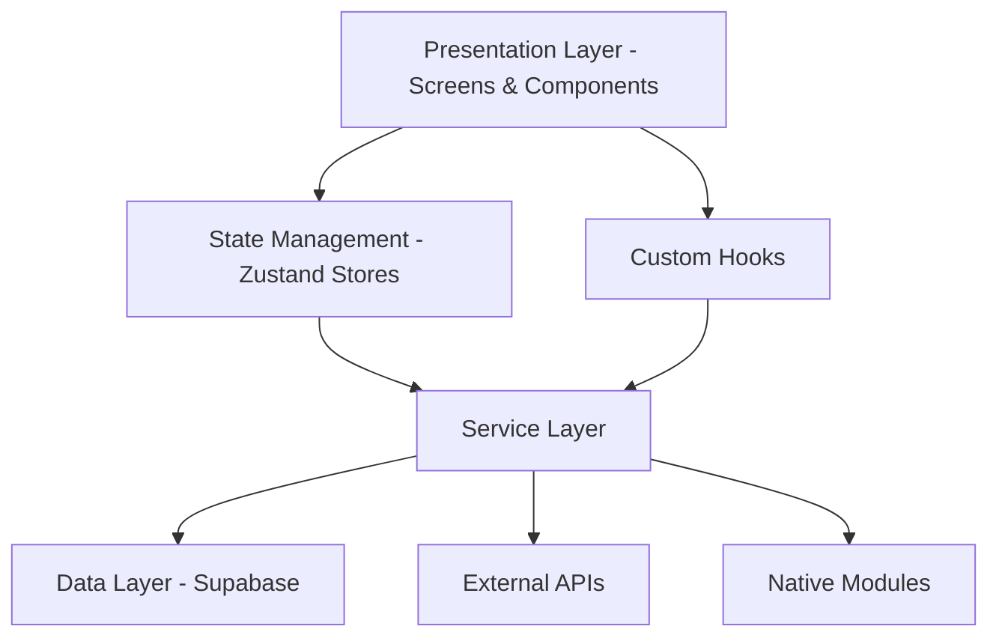

# Comprehensive Analysis Report: Toxic Confessions App

## Executive Summary

This report provides a comprehensive analysis of the "Toxic Confessions" React Native application, consolidating findings from multiple analysis reports including screen analysis, hooks analysis, and codebase review. The app is a social media platform focused on anonymous video confessions with advanced privacy features including real-time face blur and emoji overlays.

### Key Findings Overview

**Overall Assessment**: The application demonstrates solid architecture with good separation of concerns in most areas, but has critical issues in video recording/processing components and React hooks implementation that require immediate attention.

**Critical Issues**:
1. React Hook rule violations in `useScreenStatus` that will cause runtime errors
2. Memory leaks in video processing components, particularly frame processors
3. Performance bottlenecks in real-time video processing
4. Inadequate error handling in several critical services

**Positive Aspects**:
1. Well-structured authentication system
2. Comprehensive video analytics and optimization services
3. Thoughtful privacy features with multiple implementation approaches
4. Good performance optimization in most non-video components

## Table of Contents

1. [Application Overview](#application-overview)
2. [Architecture Analysis](#architecture-analysis)
3. [Critical Issues](#critical-issues)
4. [Detailed Findings by Category](#detailed-findings-by-category)
   - [UI/UX Components](#uiux-components)
   - [Services](#services)
   - [API Integration](#api-integration)
   - [React Hooks](#react-hooks)
5. [Code Examples](#code-examples)
6. [Prioritized Action Plan](#prioritized-action-plan)
7. [Conclusion](#conclusion)

## Application Overview

### Purpose and Functionality

The "Toxic Confessions" app is a social media platform that allows users to:
- Record and share anonymous video confessions
- Apply real-time privacy effects (face blur, emoji overlays)
- Interact with content through likes, comments, and shares
- Browse trending content and hashtags
- Manage profiles and settings

### Technology Stack

- **Framework**: React Native with Expo
- **Language**: TypeScript
- **State Management**: Zustand
- **Database**: Supabase
- **Video Processing**: Vision Camera, Expo Camera, Custom Native Modules
- **Authentication**: Supabase Auth
- **Monetization**: RevenueCat for subscriptions, AdMob for ads

### Key Features

1. **Privacy-Focused Video Recording**
   - Real-time face blur using Vision Camera
   - Emoji overlay for additional anonymity
   - On-device processing for privacy

2. **Social Features**
   - Video feed with TikTok-style navigation
   - Comment system with threading
   - Like, save, and share functionality
   - Trending hashtags and content

3. **Performance Optimization**
   - Adaptive video quality based on network
   - Smart preloading and caching
   - Background video processing queue

4. **Monetization**
   - Premium subscriptions with enhanced features
   - Ad integration with smart placement

## Architecture Analysis

### Overall Architecture

The app follows a layered architecture with clear separation of concerns:



### Component Architecture

The UI is organized into logical component categories:
- **Authentication**: SignInScreen, SignUpScreen
- **Video Recording**: FaceBlurRecordScreen, VideoRecordScreen, VisionCameraRecordScreen
- **Video Playback**: VideoPlayerScreen, VideoPreviewScreen
- **Social Features**: HomeScreen, TrendingScreen, VideoFeedScreen
- **User Management**: ProfileScreen, SettingsScreen
- **Content Management**: CreateConfessionScreen, MySecretsScreen, SavedScreen

### Service Architecture

The service layer is well-structured with specialized services:
- **Video Services**: VideoDataService, OptimizedVideoService, UnifiedVideoService
- **Privacy Services**: Anonymiser, VisionCameraProcessor, EmojiOverlayProcessor
- **Analytics**: VideoAnalyticsAggregator, PerformanceMonitor
- **Monetization**: AdMobService, RevenueCatMCPService
- **Utility**: ErrorReportingService, TrackingService, ServiceInitializer

## Critical Issues

### 1. React Hook Rule Violations (Critical)

**Location**: `src/hooks/useScreenStatus.ts` (lines 168-180)

**Issue**: Conditional hook usage inside a loop violates React Hook rules.

```typescript
// PROBLEMATIC CODE
operations.forEach((operation) => {
  // eslint-disable-next-line react-hooks/rules-of-hooks
  statuses[operation] = useScreenStatus({
    screenName: `${screenName}_${operation}`,
    enableRetry: true,
  });
});
```

**Impact**: This will cause unpredictable behavior and runtime errors.

**Recommendation**: Refactor to use a single hook that manages multiple operations or restructure the component to avoid conditional hooks.

### 2. Memory Leaks in Video Processing (High Priority)

**Location**: `src/hooks/useSimpleFaceBlur.ts` and `src/hooks/useVideoPerformanceOptimization.ts`

**Issue**: Frame processors and intervals not properly cleaned up when components unmount.

```typescript
// PROBLEMATIC CODE
const frameProcessor = useFrameProcessor(
  (frame: any) => {
    // Processing logic
  },
  [detectFaces, isAvailable, enabled, useFrameProcessor],
);
// Missing cleanup in useEffect
```

**Impact**: Memory leaks as processors continue running after unmount.

**Recommendation**: Add proper cleanup in useEffect for all frame processors and intervals.

### 3. Performance Issues in Video Recording (High Priority)

**Location**: `src/screens/FaceBlurRecordScreen.tsx`, `src/screens/VisionCameraRecordScreen.tsx`

**Issue**: Complex real-time video processing impacts performance.

- Heavy use of worklets and frame processors
- Multiple rendering paths based on conditions
- Inefficient state management for video processing

**Impact**: Poor user experience, potential crashes on lower-end devices.

**Recommendation**: Optimize frame processing, consolidate rendering paths, and improve state management.

### 4. Error Handling Deficiencies (Medium Priority)

**Location**: `src/hooks/useCaptionGeneration.ts`, `src/hooks/useSpeechRecognition.ts`

**Issue**: Inadequate error handling and UI feedback in hooks.

```typescript
// PROBLEMATIC CODE
Alert.alert("Caption Error", errorMessage); // Should not be in a hook
```

**Impact**: Reduced error visibility and poor user experience.

**Recommendation**: Return error states from hooks and let components handle UI feedback.

## Detailed Findings by Category

### UI/UX Components

#### Authentication Screens
- **Status**: ✅ Good implementation
- **Findings**: Proper form validation, secure credential handling, good accessibility.

#### Video Recording Screens
- **Status**: ⚠️ Potential issues
- **Findings**: Complex implementations, performance concerns, memory leak potential.

#### Video Playback Screens
- **Status**: ✅ Mostly good implementation
- **Findings**: Clean implementation, good performance, proper error handling.

#### Social Feature Screens
- **Status**: ✅ Good implementation
- **Findings**: Well-optimized with FlashList, proper error handling, good state management.

#### User Management Screens
- **Status**: ⚠️ Some issues
- **Findings**: ProfileScreen has complex state management and potential performance issues.

### Services

#### Video Services
- **Status**: ✅ Well-architected
- **Findings**: Comprehensive video optimization, analytics, and processing services.

#### Privacy Services
- **Status**: ⚠️ Mixed implementation
- **Findings**: Good privacy features but some implementations have memory leaks and performance issues.

#### Analytics Services
- **Status**: ✅ Comprehensive
- **Findings**: Detailed video analytics, performance monitoring, and user engagement tracking.

#### Monetization Services
- **Status**: ✅ Good implementation
- **Findings**: Well-integrated subscription and ad services.

### API Integration

#### External APIs
- **Status**: ✅ Good implementation
- **Findings**: Proper error handling, secure API calls, good response management.

#### Database Integration
- **Status**: ✅ Good implementation
- **Findings**: Well-structured Supabase integration with proper error handling.

### React Hooks

#### Custom Hooks Analysis
- **Status**: ⚠️ Multiple issues
- **Findings**: 
  - Hook rule violations in `useScreenStatus`
  - Memory leaks in `useSimpleFaceBlur`, `useVideoPerformanceOptimization`, `useScrollRestoration`
  - Performance issues with multiple intervals
  - Error handling issues in `useCaptionGeneration`, `useSpeechRecognition`
  - TypeScript issues with `any` types

## Code Examples

### Example 1: React Hook Rule Violation Fix

**Before (Problematic)**:
```typescript
// src/hooks/useScreenStatus.ts
operations.forEach((operation) => {
  // eslint-disable-next-line react-hooks/rules-of-hooks
  statuses[operation] = useScreenStatus({
    screenName: `${screenName}_${operation}`,
    enableRetry: true,
  });
});
```

**After (Fixed)**:
```typescript
// src/hooks/useScreenStatus.ts
// Use a single hook to manage all operations
const statuses = useMultipleScreenStatus({
  operations,
  screenName,
  enableRetry: true,
});
```

### Example 2: Memory Leak Fix in Frame Processor

**Before (Problematic)**:
```typescript
// src/hooks/useSimpleFaceBlur.ts
const frameProcessor = useFrameProcessor(
  (frame: any) => {
    // Processing logic
  },
  [detectFaces, isAvailable, enabled, useFrameProcessor],
);
// Missing cleanup
```

**After (Fixed)**:
```typescript
// src/hooks/useSimpleFaceBlur.ts
const frameProcessor = useFrameProcessor(
  (frame: any) => {
    // Processing logic
  },
  [detectFaces, isAvailable, enabled, useFrameProcessor],
);

useEffect(() => {
  return () => {
    // Cleanup frame processor
    if (frameProcessor) {
      frameProcessor.remove();
    }
  };
}, []);
```

### Example 3: Error Handling Fix in Hooks

**Before (Problematic)**:
```typescript
// src/hooks/useCaptionGeneration.ts
const generateCaption = async () => {
  try {
    // API call
  } catch (error) {
    Alert.alert("Caption Error", errorMessage); // Should not be in hook
  }
};
```

**After (Fixed)**:
```typescript
// src/hooks/useCaptionGeneration.ts
const [error, setError] = useState<string | null>(null);

const generateCaption = async () => {
  try {
    // API call
  } catch (error) {
    setError(errorMessage); // Return error state
  }
};

return { caption, error, generateCaption };
```

## Prioritized Action Plan

### Immediate Actions (Critical - Fix within 1 week)

1. **Fix React Hook Rule Violations**
   - Refactor `useScreenStatus` to avoid conditional hooks
   - Test thoroughly to ensure no runtime errors

2. **Fix Memory Leaks in Video Processing**
   - Add proper cleanup to all frame processors
   - Implement cleanup for intervals and timeouts
   - Test memory usage during video recording/playback

### Short-Term Actions (High Priority - Fix within 2-3 weeks)

1. **Optimize Video Recording Performance**
   - Consolidate conditional rendering paths
   - Improve state management for video processing
   - Add performance monitoring

2. **Improve Error Handling**
   - Remove Alert calls from hooks
   - Return error states from hooks
   - Implement proper error boundaries

3. **Fix TypeScript Issues**
   - Replace `any` types with proper interfaces
   - Add type safety to API responses
   - Update JSDoc documentation

### Medium-Term Actions (Medium Priority - Fix within 1 month)

1. **Refactor Complex Components**
   - Simplify ProfileScreen state management
   - Optimize VideoPreviewScreen
   - Improve component reusability

2. **Enhance Testing**
   - Add unit tests for critical hooks
   - Implement integration tests for video recording
   - Add performance testing

3. **Improve Documentation**
   - Add comprehensive JSDoc for all services
   - Create component documentation
   - Document video processing architecture

### Long-Term Actions (Low Priority - Fix within 2-3 months)

1. **Architecture Improvements**
   - Consider migrating to a more robust state management solution
   - Implement a proper dependency injection system
   - Standardize error handling patterns

2. **Advanced Features**
   - Implement more sophisticated video effects
   - Add real-time collaboration features
   - Enhance analytics capabilities

## Conclusion

The "Toxic Confessions" app demonstrates a solid foundation with well-structured services and components in most areas. However, there are critical issues in React hooks implementation and video processing components that require immediate attention to ensure app stability and performance.

The most urgent issues are:
1. React Hook rule violations that will cause runtime errors
2. Memory leaks in video processing components
3. Performance bottlenecks in real-time video processing

Addressing these issues according to the prioritized action plan will significantly improve the app's stability, performance, and user experience. The app has a strong foundation that, with these improvements, will provide a robust and engaging user experience.

### Next Steps

1. Begin with fixing the React Hook rule violations in `useScreenStatus`
2. Implement proper cleanup for frame processors and intervals
3. Optimize video recording performance
4. Improve error handling throughout the app
5. Continue with regular code reviews and testing to prevent future issues

By following this action plan, the development team can systematically address the identified issues and improve the overall quality of the application.