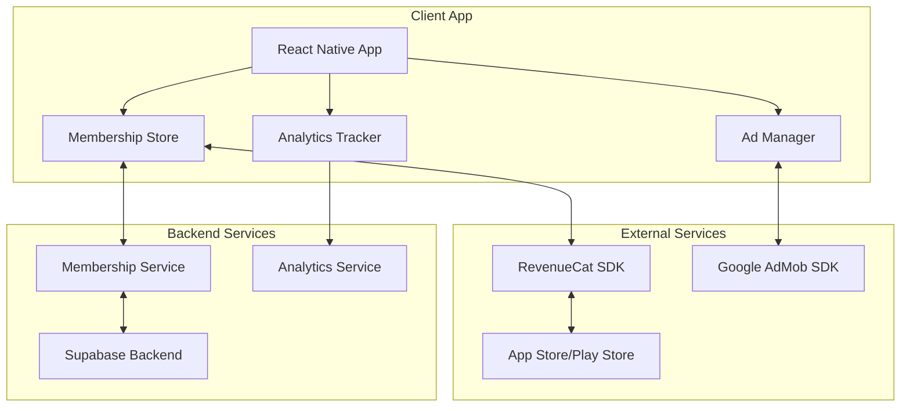

# SupaSecret Monetization Strategy & Implementation Guide

## Executive Summary

This document outlines a comprehensive monetization strategy for SupaSecret, leveraging a freemium model with strategic ad placements and premium subscriptions. Our approach combines RevenueCat for subscription management and React Native Google Mobile Ads for advertisement delivery, creating multiple revenue streams while maintaining excellent user experience.

## Table of Contents

1. [Business Strategy](#business-strategy)
2. [Feature Tier Breakdown](#feature-tier-breakdown)
3. [Pricing Strategy](#pricing-strategy)
4. [Ad Placement Strategy](#ad-placement-strategy)
5. [Technical Architecture](#technical-architecture)
6. [RevenueCat Integration](#revenuecat-integration)
7. [Google Mobile Ads Integration](#google-mobile-ads-integration)
8. [Analytics & Metrics](#analytics--metrics)
9. [Implementation Timeline](#implementation-timeline)
10. [Security & Compliance](#security--compliance)

## Business Strategy

### Revenue Model
- **Freemium Model**: Core features free with ads, premium features behind paywall
- **Subscription Tiers**: Monthly and annual plans with significant annual discount
- **Ad Revenue**: Strategic placement of non-intrusive ads for free users

### Target Metrics
- **Conversion Rate**: 5-8% free to paid conversion
- **ARPU**: $0.50-$1.00 for free users, $4.99 for premium users
- **Retention**: 70% monthly retention for premium users
- **Ad Revenue**: $0.15-$0.30 per daily active user

## Feature Tier Breakdown

### Free Tier Features
- Post anonymous secrets (text and images)
- Record videos up to 60 seconds
- View and interact with all content
- Basic filters and effects
- Standard video quality (720p)
- Limited saves (10 per day)
- Community interactions (likes, comments)
- Basic themes

### Premium Tier Features (SupaSecret+)
- **Ad-free experience**: Complete removal of all advertisements
- **Extended videos**: Up to 5 minutes video duration
- **4K video quality**: Ultra-high definition uploads
- **Unlimited saves**: Save as many secrets as desired
- **Advanced filters**: Exclusive premium effects and filters
- **Priority processing**: Faster upload and processing times
- **Custom themes**: Exclusive color schemes and UI themes
- **Early access**: Beta features and new releases
- **Profile badges**: Premium user indicator
- **Analytics insights**: View detailed stats on your secrets

## Pricing Strategy

### Subscription Plans

| Plan | Price | Savings | Billing |
|------|-------|---------|---------|
| Monthly | $4.99 | - | Recurring monthly |
| Annual | $29.99 | 50% | Recurring yearly |

### Pricing Rationale
- **Monthly**: Standard mobile app premium pricing
- **Annual**: Aggressive discount to encourage commitment
- **Regional Pricing**: Consider localized pricing for emerging markets

### Promotional Strategies
- 7-day free trial for new users
- 50% off first month for early adopters
- Referral program: 1 month free for each successful referral
- Seasonal promotions (Black Friday, New Year)

## Ad Placement Strategy

### Ad Types & Placement

#### 1. Feed Ads
- **Frequency**: Every 5-7 posts in the main feed
- **Format**: Native ads matching secret card design
- **User Experience**: Seamless integration, clearly marked as "Sponsored"

#### 2. Interstitial Ads
- **Triggers**: 
  - After posting a secret (not every time)
  - When navigating between major sections (limited frequency)
- **Frequency Cap**: Maximum 1 per 5 minutes
- **Skip Option**: Available after 5 seconds

#### 3. Rewarded Video Ads
- **Purpose**: Unlock temporary premium features
- **Rewards**:
  - 24-hour ad-free experience
  - One 5-minute video upload
  - 10 additional saves
- **User Choice**: Always optional, never forced

#### 4. Banner Ads
- **Placement**: Bottom of screen in non-critical views
- **Screens**: Search results, settings, profile sections
- **Never shown on**: Secret creation, video recording, direct messages

### Ad Frequency Algorithm
```typescript
interface AdFrequencyConfig {
  feedAdInterval: 5-7 posts (randomized)
  interstitialCooldown: 300 seconds
  dailyInterstitialCap: 10
  bannerExcludedScreens: ['CreateSecret', 'RecordVideo', 'DirectMessage']
  rewardedVideoDailyCap: 3
}
```

## Technical Architecture

### System Components



### Data Flow

1. **Subscription Flow**:
   - User initiates purchase → RevenueCat SDK → Store → Receipt validation
   - RevenueCat webhook → Backend update → Sync to app

2. **Ad Display Flow**:
   - Check membership status → Determine ad eligibility → Request ad
   - Display ad → Track impression → Report analytics

## RevenueCat Integration

### Setup & Configuration

#### 1. RevenueCat Project Setup
```bash
# Install RevenueCat SDK
npm install react-native-purchases
cd ios && pod install
```

#### 2. Configuration
```typescript
// src/services/RevenueCatService.ts
import Purchases from 'react-native-purchases';

export class RevenueCatService {
  static async initialize() {
    await Purchases.setDebugLogsEnabled(__DEV__);
    
    if (Platform.OS === 'ios') {
      await Purchases.configure({ apiKey: process.env.REVENUECAT_IOS_KEY });
    } else {
      await Purchases.configure({ apiKey: process.env.REVENUECAT_ANDROID_KEY });
    }
    
    // Set user ID from Supabase auth
    const user = await supabase.auth.getUser();
    if (user) {
      await Purchases.logIn(user.id);
    }
  }
  
  static async purchasePackage(packageType: 'monthly' | 'annual') {
    try {
      const offerings = await Purchases.getOfferings();
      const package = packageType === 'monthly' 
        ? offerings.current?.monthly 
        : offerings.current?.annual;
        
      if (!package) throw new Error('Package not found');
      
      const { customerInfo } = await Purchases.purchasePackage(package);
      return this.processPurchase(customerInfo);
    } catch (error) {
      if (!error.userCancelled) {
        throw error;
      }
    }
  }
  
  static async restorePurchases() {
    const customerInfo = await Purchases.restorePurchases();
    return this.processPurchase(customerInfo);
  }
  
  private static processPurchase(customerInfo: CustomerInfo) {
    const isActive = customerInfo.entitlements.active['premium'] !== undefined;
    const expirationDate = customerInfo.entitlements.active['premium']?.expirationDate;
    
    // Update local state
    membershipStore.getState().updateMembership({
      tier: isActive ? 'plus' : 'free',
      expiresAt: expirationDate,
      isActive
    });
    
    return { isActive, expirationDate };
  }
}
```

#### 3. Webhook Configuration
```typescript
// Supabase Edge Function: handle-revenuecat-webhook
export async function handleRevenueCatWebhook(req: Request) {
  const { event } = await req.json();
  
  switch (event.type) {
    case 'INITIAL_PURCHASE':
    case 'RENEWAL':
      await updateUserMembership(event.app_user_id, {
        tier: 'plus',
        status: 'active',
        expires_at: event.expiration_at,
        product_id: event.product_id,
        store_transaction_id: event.transaction_id
      });
      break;
      
    case 'CANCELLATION':
    case 'EXPIRATION':
      await updateUserMembership(event.app_user_id, {
        tier: 'free',
        status: 'expired',
        expires_at: null
      });
      break;
      
    case 'BILLING_ISSUE':
      await notifyUserBillingIssue(event.app_user_id);
      break;
  }
  
  return new Response('OK', { status: 200 });
}
```

## Google Mobile Ads Integration

### Setup & Implementation

#### 1. AdMob Configuration
```typescript
// src/services/AdService.ts
import { 
  AdMob, 
  BannerAd, 
  InterstitialAd, 
  RewardedAd,
  TestIds 
} from 'react-native-google-mobile-ads';

export class AdService {
  private static interstitialAd: InterstitialAd;
  private static rewardedAd: RewardedAd;
  private static lastInterstitialTime = 0;
  
  static async initialize() {
    await AdMob.initialize();
    
    // Configure ad units
    this.interstitialAd = InterstitialAd.createForAdRequest(
      __DEV__ ? TestIds.INTERSTITIAL : Config.ADMOB_INTERSTITIAL_ID
    );
    
    this.rewardedAd = RewardedAd.createForAdRequest(
      __DEV__ ? TestIds.REWARDED : Config.ADMOB_REWARDED_ID
    );
    
    // Preload ads
    this.interstitialAd.load();
    this.rewardedAd.load();
  }
  
  static shouldShowAd(): boolean {
    const { tier } = membershipStore.getState();
    return tier === 'free';
  }
  
  static async showInterstitial(placement: string) {
    if (!this.shouldShowAd()) return;
    
    // Check frequency cap
    const now = Date.now();
    if (now - this.lastInterstitialTime < 300000) return; // 5 min cooldown
    
    try {
      if (this.interstitialAd.loaded) {
        await this.interstitialAd.show();
        this.lastInterstitialTime = now;
        
        // Track event
        Analytics.track('ad_shown', {
          type: 'interstitial',
          placement
        });
        
        // Reload for next time
        this.interstitialAd.load();
      }
    } catch (error) {
      console.error('Failed to show interstitial:', error);
    }
  }
  
  static async showRewarded(rewardType: 'ad_free_day' | 'extended_video' | 'extra_saves') {
    if (!this.rewardedAd.loaded) {
      Alert.alert('Ad not ready', 'Please try again in a moment');
      return;
    }
    
    return new Promise((resolve, reject) => {
      const unsubscribe = this.rewardedAd.addAdEventListener('earned_reward', (reward) => {
        // Grant reward
        this.grantReward(rewardType);
        unsubscribe();
        resolve(reward);
      });
      
      this.rewardedAd.show().catch(error => {
        unsubscribe();
        reject(error);
      });
    });
  }
  
  private static grantReward(rewardType: string) {
    switch (rewardType) {
      case 'ad_free_day':
        membershipStore.getState().activateTemporaryPremium(24 * 60 * 60 * 1000);
        break;
      case 'extended_video':
        membershipStore.getState().addVideoCredit(1);
        break;
      case 'extra_saves':
        membershipStore.getState().addSaveCredits(10);
        break;
    }
  }
}
```

#### 2. Feed Ad Component
```typescript
// src/components/FeedAd.tsx
export const FeedAd: React.FC<{ index: number }> = ({ index }) => {
  const { tier } = useMembershipStore();
  
  if (tier !== 'free') return null;
  
  // Randomize interval between 5-7 posts
  const adInterval = Math.floor(Math.random() * 3) + 5;
  if (index % adInterval !== 0) return null;
  
  return (
    <View style={styles.adContainer}>
      <Text style={styles.sponsoredLabel}>Sponsored</Text>
      <BannerAd
        unitId={__DEV__ ? TestIds.BANNER : Config.ADMOB_FEED_BANNER_ID}
        size={BannerAdSize.MEDIUM_RECTANGLE}
        onAdLoaded={() => {
          Analytics.track('ad_loaded', { type: 'feed_banner' });
        }}
        onAdFailedToLoad={(error) => {
          console.error('Feed ad failed to load:', error);
        }}
      />
    </View>
  );
};
```

## Analytics & Metrics

### Key Performance Indicators (KPIs)

#### Revenue Metrics
- **MRR (Monthly Recurring Revenue)**: Total monthly subscription revenue
- **ARPU (Average Revenue Per User)**: Combined ad + subscription revenue
- **LTV (Lifetime Value)**: Predicted total revenue per user
- **CAC (Customer Acquisition Cost)**: Cost to acquire paying user

#### Subscription Metrics
- **Free to Paid Conversion Rate**: % of users who upgrade
- **Churn Rate**: Monthly cancellation rate
- **Reactivation Rate**: % of churned users who resubscribe
- **Trial Conversion Rate**: % of trial users who convert

#### Ad Metrics
- **eCPM (Effective Cost Per Mille)**: Revenue per 1000 impressions
- **Fill Rate**: % of ad requests filled
- **CTR (Click Through Rate)**: Ad engagement rate
- **User Ad Tolerance**: % of users who don't churn due to ads

### Analytics Implementation
```typescript
// src/services/AnalyticsService.ts
export class AnalyticsService {
  static trackMonetizationEvent(event: string, properties: any) {
    // Send to multiple analytics providers
    amplitude.track(event, properties);
    mixpanel.track(event, properties);
    
    // Store in Supabase for custom dashboards
    supabase.from('analytics_events').insert({
      event_name: event,
      properties,
      user_id: getCurrentUserId(),
      timestamp: new Date().toISOString()
    });
  }
  
  static monetizationEvents = {
    // Subscription events
    TRIAL_STARTED: 'monetization_trial_started',
    SUBSCRIPTION_PURCHASED: 'monetization_subscription_purchased',
    SUBSCRIPTION_RENEWED: 'monetization_subscription_renewed',
    SUBSCRIPTION_CANCELLED: 'monetization_subscription_cancelled',
    SUBSCRIPTION_EXPIRED: 'monetization_subscription_expired',
    
    // Ad events
    AD_REQUESTED: 'monetization_ad_requested',
    AD_LOADED: 'monetization_ad_loaded',
    AD_SHOWN: 'monetization_ad_shown',
    AD_CLICKED: 'monetization_ad_clicked',
    AD_FAILED: 'monetization_ad_failed',
    REWARDED_AD_COMPLETED: 'monetization_rewarded_ad_completed',
    
    // Feature usage
    PREMIUM_FEATURE_USED: 'monetization_premium_feature_used',
    PAYWALL_SHOWN: 'monetization_paywall_shown',
    PAYWALL_DISMISSED: 'monetization_paywall_dismissed'
  };
}
```

### Dashboard Metrics Query
```sql
-- Daily Revenue Dashboard
WITH daily_metrics AS (
  SELECT 
    DATE(created_at) as date,
    COUNT(DISTINCT CASE WHEN tier = 'plus' THEN user_id END) as paid_users,
    COUNT(DISTINCT user_id) as total_users,
    SUM(CASE WHEN event = 'ad_revenue' THEN revenue ELSE 0 END) as ad_revenue,
    COUNT(CASE WHEN event = 'subscription_purchased' THEN 1 END) * 4.99 as new_subscription_revenue
  FROM analytics_events
  WHERE created_at >= CURRENT_DATE - INTERVAL '30 days'
  GROUP BY DATE(created_at)
)
SELECT 
  date,
  paid_users,
  total_users,
  ROUND(paid_users::numeric / NULLIF(total_users, 0) * 100, 2) as conversion_rate,
  ad_revenue,
  new_subscription_revenue,
  ad_revenue + new_subscription_revenue as total_daily_revenue
FROM daily_metrics
ORDER BY date DESC;
```

## Implementation Timeline

### Phase 1: Foundation (Week 1-2)
- [ ] Set up RevenueCat account and configure products
- [ ] Integrate RevenueCat SDK into the app
- [ ] Set up AdMob account and ad units
- [ ] Implement basic subscription purchase flow
- [ ] Create webhook endpoints for subscription events

### Phase 2: Ad Integration (Week 3-4)
- [ ] Integrate Google Mobile Ads SDK
- [ ] Implement feed ad placements
- [ ] Add interstitial ad logic with frequency caps
- [ ] Create rewarded video ad system
- [ ] Implement ad-free logic for premium users

### Phase 3: Analytics & Optimization (Week 5-6)
- [ ] Set up analytics tracking for all monetization events
- [ ] Create revenue dashboard in Supabase
- [ ] Implement A/B testing framework
- [ ] Add subscription management UI
- [ ] Implement restore purchases functionality

### Phase 4: Launch & Iteration (Week 7-8)
- [ ] Soft launch to 10% of users
- [ ] Monitor metrics and gather feedback
- [ ] Optimize ad placements based on data
- [ ] Adjust pricing if needed
- [ ] Full rollout to all users

## Security & Compliance

### Data Protection
- Store all sensitive subscription data server-side
- Never expose API keys in client code
- Implement receipt validation on backend
- Use HTTPS for all API communications

### Compliance Requirements
- **App Store Guidelines**: Follow Apple's in-app purchase requirements
- **Play Store Policies**: Comply with Google Play billing policies
- **GDPR**: Implement consent management for EU users
- **COPPA**: Ensure age-appropriate ad content
- **Tax Compliance**: Handle VAT/GST for international subscriptions

### Implementation Checklist
```typescript
interface ComplianceChecklist {
  // Privacy
  privacyPolicyUrl: string;
  termsOfServiceUrl: string;
  dataProcessingAgreement: boolean;
  
  // User Rights
  subscriptionCancellation: 'easy_in_app';
  refundPolicy: 'follow_store_guidelines';
  dataExportOption: boolean;
  accountDeletion: boolean;
  
  // Technical
  receiptValidation: 'server_side';
  encryptedStorage: boolean;
  secureApiCommunication: 'https_only';
}
```

## Conclusion

This monetization strategy balances user experience with revenue generation through a well-designed freemium model. By combining strategic ad placements with compelling premium features, we can maximize revenue while maintaining user satisfaction. The implementation focuses on technical excellence, comprehensive analytics, and iterative optimization based on real user data.

### Success Criteria
- Achieve 5%+ free to paid conversion rate
- Maintain <2% monthly churn rate
- Generate $0.75+ ARPU across all users
- Maintain 4.5+ app store rating

### Next Steps
1. Review and approve monetization strategy
2. Set up RevenueCat and AdMob accounts
3. Begin Phase 1 implementation
4. Schedule weekly reviews of progress and metrics